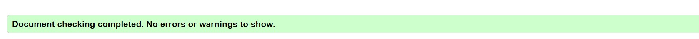
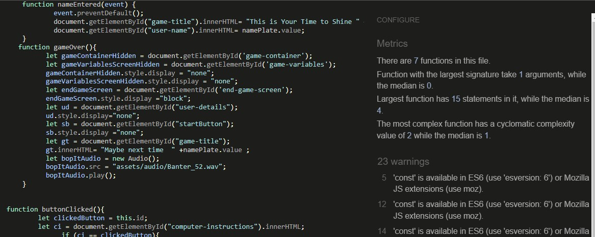
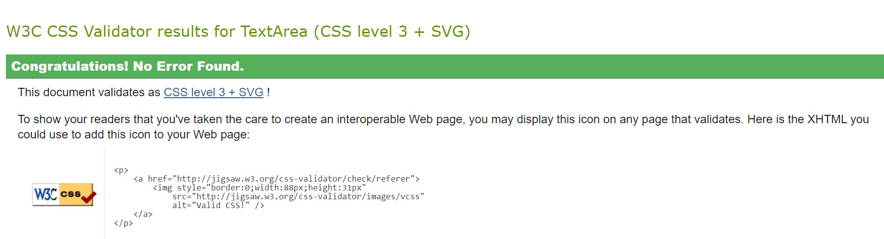

## Project 2 - Bernadette McDonnell

+ [User Experience](#userexperience "User Experience")
  + [User Stories](#user-stories "User Stories")
  + [User Goals](#user-goals "User Goals")
  + [Requirements](#requirements "Requirements")
  + [Design](#design "Design")
    + [Typography](#typography "Typography")
  + [Testing](#testing "Testing")
    + [Functionality](#functionality "Functionality")
    + [Styling](#styling "Styling")
    + [Error Log](#errorlog "Error Log")
    + [CSS Validation](#cssvalidation "CSS Validation")
    + [HTML Validation](#htmlvalidation "HTML Validation")

  + [Citations](#citations "Citations")
+ [Lessons Learned](#lessons-learned “Lessons Learned")
+ [Quirks](#quirks "Quirks")
  + [Future Features](#future-features "Future Features")

####  Bop-it Online ineractive site
My idea for project 2 is for an interactive 'Bop-it' online game. To meet the project criteria, this needs to be an interactive site as well as incorporating user choice when it comes to the display of information, or to achieve their preferred goals.

## Technologies used:
* HTML
* CSS
* JavaScript
* Gitpod for deployment 

Bop it was a hand held game created by Hasbro popularised in the 90's as a boredom beater, whereby the user would be guided by audio to selectand engage with one of the 5 choices below.

  *Bop it Flick it,Twist it, Pull it, Spin it*

The user had approximately 4 few seconds to make the correct choice or they lose the game. The time decreases the higher the score you attain thus increasing the difficulty of the game, and increasing the chance of human error. My interactive site/ game will be built around the same principles of chance. The game was renowned for it's use of cheeky slang and comments if you lose - something I want to keep as true to life as possible to make it a thoroughly reminiscint reimagining of the Hasbro 90s classic. In the era of fidget spinners I wanted to reimagine a game that brough many hours of enjoyment into my home.

I chose to add a dark mode feature as this has become a really popular element in websites and applications in recent years, an option which I myself use on a daily basis as it increases the contrast for me and is less harsh on my eyes. 

#### Elements I wish to include:

* Theme selector/ toggle - bright and light or dark mode
* Name input field prior to game kick off
* Interactive Title to incorporate username / include the cheeky element of the Hasbro classic
* Scoreboard  
* High score dahsboard on end game page.

## Project / UI Flow
* User enters usernmae in text input
* Message appears - Hi username, please hit start to begin or click here to view the rules. 
* Start Button - count down from 5
* Onclick the computer selects at random from Bop it, twist it, flick it pull it.
* The user has 4 seconds to hit the corresponding button
* If the user hits the wrong button - Game Over displays with the score
* If the user makes the right choice it adds a point to the score and keeps looping until the user makes a wrong choice
* After 10 correct selections, the user has 3 seconds to make the right selection
* After 20 correct seclections, the user has 2 seconds
* After 30 correct selections the user has 1 second.
* If user achieves a high score it is saved to the Scoreboard with the username.
* If user makes wrong choice - end game screen will display. 

#### UX
##  External user’s goal:

* The site’s users want to play an online game that has elements of chance. 
* The site's users want to be able to easily understand the function of the site.
* The site users want to be able to easily navigate the site / not requiring many clicks or remembering navigation.
* The site users want to be able to manipulate the UI to suit thier display preference.

##  Site owner's goal:

* The site’s goal is to provide a challenging game with increasing levels of difficulty to entertain online users.
* The site's goal is to provide a simple UI that allows user have input into the display of information

## Design
The colors I have chosen are once again in line with my personal minimalistic preference, but keeping in line with the Bop IT/ Hasbro  Branding colours.
I am clearly not a graphic designer, so I tried to use some of the knowledge from the course content to ensure I follow key practices of UX design.

One website I found really helpful for selecting the UI colours was the below:
https://flatuicolors.com/palette/us

#### Light Mode / default
Background: (208, 216, 218, 0.808);
Font: Black

#### Dark Mode
Background color: Black
font color: white 

#### Typography
The typography used throughout the site was specifically chosen as I felt it was a bold yet readable font, again tying in with the Hasbro branding.

Font: 

####  Media
The audio for the game was taken from the below website and was the audio from the original game created by Hasbro:

https://www.sounds-resource.com/mobile/bopit/sound/23634/

## Citations
I drew inspiration heavily from the love Maths project completed as part of the course. I used this as almost a template or boiler plate for structural purposes.

I relied heavily on Font awesome for thier amazing selection of icons and typography 

Adding Grit / texture - code taken from the below website:
https://www.viget.com/articles/easy-textures-with-css-masks/

w3 schoools
Github

https://stackoverflow.com/questions/19844545/replacing-css-file-on-the-fly-and-apply-the-new-style-to-the-page

* Read-me guidance:
https://github.com/adam-p/markdown-here/wiki/Markdown-Cheatsheet#table-of-contents

Thank you to my wonderful mentor Martina, for her excellent and helpful insight. My focus from the outset was to ensure I hit the pass criteria, and Martina helped break this down for me into easier to manage chunks, without which i\ would have essentially allowed the scope to creep into a non plausable for delivery territory.

Thank you to Kasia Bogucka the cohort leader for her kind nature and dedication to ensure we all success at our 

## Testing
#### Deubgging
I made the error of using alerts for my first pass at validation testing, after much frustration I removed them to use console.logs instead which allow for ease of testing
The first round of testing was physically checking for errors in the validators, which was completed on a daily basis was to run through the HTML and CSS validators to ensure there were no errors. I decided to do this daily to reduce the chance of introducing lots of errors in to my code which would take a long time to debug and resolve. This is one of the major lessons learned from my last project.

From project 1 I learned the importance of using Dev tools for the first pass at debugging, but also for altering UI elements and checking the outcome before amending the branch which runs the risk of introducing new errors.

#### Style
My initial template I had put together for the game changed vastly based on the user feedback I received.
My initial styling had a toggle for dark mode, a submit button for entering your name and a start game button to start the game.

The initial screen contained all elements ( game container, buttons etc)

From the feedback I received, and also trying to keep in line with UX best practices, I simplied the workflow of the page, removing the extra button, removing the toggle to replace with a simple bulb image, setting elements to hidden by default until they are needed. 

#### HTML Validation:

#### Javascript Validation

#### CSS Validation

#### User testing

###### Mentor session
 I tried to make the best use of ym time with my mentor Martina and made it clear that my goal here is to ensure I am ticking the pass criteria boxes at a minimum, and then focus on any added extra elements I can achieve. 

###### Tutor

I used Tutor support for this project as I really struggled with some of my Javascript functions. The tutors, while not fixing or amending my code, were able to steer me back onto the right path by reiterating industry standards/ common practice in key areas I was clearly lacking.

## Deployment
As with the previous assessment I deployed this assignemnet through Gitpod and have really come to terms with the interface / using the terminal etc, which I initially had struggled with.

My approach for this assessment was quite different. I broke the scope down into subsections, and while I will readily admit to losing a substantial amount of time working on non critical elements ( dark mode), I found it a lot easier to manage my time for this project.

I deployed a Github page for this project very early which allowed me the opportunity to test this from my mobile at random, and easily share with peers and friends to for testing purposes:

https://mcdonnellb.github.io/bop-it-online/

I also tried to keep the commits very specific to enable ease of reference ( so when I accidentally remove too much code for example it's easy for me to locate) but also to ensure I am getting used to that iterative process, focusing on the task/ feature at hand, commiting, then moving on to the next item on the list. 

## Error Log 
Some of the critical errors found and the items used to overcome the errors

* Start Game funtion - initially I had the generate random computer instruction function within start game function and const variables set for the randomise function.
Start Game would only generate item from array once, even if clicked on multiple times, you had to refresh the page then reclick and it may generate a different item. This was the longest standing problem and was the simplest to fix.

#### Known Bugs / Quirks 
* If you click on the welcome section it will update with the rules but this screen remains
* There is no max score so the game can go on indefinitely
* The scoreboard is not a functioning scoreboard that pushes the usernmae and the score to an array - that's something I will cover in future iterations.
* Styling of buttons- I specifically have them placed in a non symettrical fashion again trying to keep with the original bop it design.
* Grit texture is not working & so I will remove before submission

#### Items to be addressed in future iterations

Items which I had intended to include ( after I let scope creep get the better of me) but would include in future development:

* Include the audio files noted in the media section - this would ensure accessability to the use of the game for those who are visually impaired. This would include the generation of a random computer instruction, the taunts if you lose, and also the cheers if you get a high score.
* High Score capture with a scoreboard on the  end game page
* Difficulty selection - eg: array for easy with 3 instructions, array for medium with 5 instructions, array for hard with 5 instructions and timer varibale of 2 seconds.

#### Lessons Learned
Keep it simple- define a basic scope and stick to it to avoid scope creep. I once agaib found myself in the situation where I was down a stackoverflow rabbit hole and W3schools looking at dark mode toggles for a huge amount of time, when infact this added nothing to the game itself. The time woudld have been better spent focussing on the core elements of the game, and then once they were implemented, looking into items such as dark mode.

This is something I struggle with, I get overwhelmed with the amount of items that need to be done, and then misinterpret or miscalculate the importance of some of the other items. This is somehting I have been working on and every time I find myself down a rabbit hole, I go back to my critical list, is the item I am working on critical, or is it a 'nice to have'.

Dont be afraid to ask for help - I sufferend in silence on this one for quite some time as I didnt want to appear to be struggling, but this really prolonged the pain when in fact sometimes peer review , or a second set of eyes is exactly what is needed.
